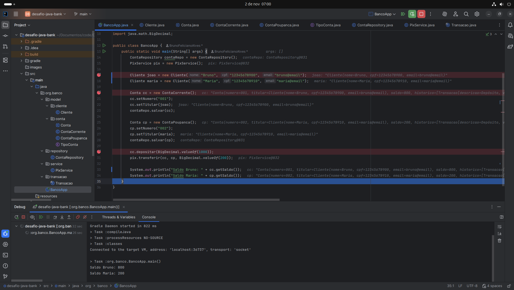

🏦 Sistema Bancário - Desafio de Programação Orientada a Objetos
📘 Descrição

Este projeto foi desenvolvido como parte do laboratório de POO com o objetivo de aplicar conceitos fundamentais de Programação Orientada a Objetos, como herança, encapsulamento, polimorfismo, abstração e reuso de código.
A aplicação simula um sistema bancário básico que permite:

Criação de contas (corrente e poupança);
Depósitos e saques;
Transferências via PIX;
Registro e histórico de transações;
Persistência simulada em memória.
________________________________________________________________________
🧠 Conceitos de POO Aplicados

| Conceito           | Onde foi aplicado                               | Descrição                                                   |
| ------------------ | ----------------------------------------------- | ----------------------------------------------------------- |
| **Abstração**      | Classe `Conta`                                  | Define atributos e comportamentos genéricos de uma conta.   |
| **Herança**        | `ContaCorrente` e `ContaPoupanca`               | Especializam `Conta` com comportamentos próprios.           |
| **Encapsulamento** | Todas as entidades (`Cliente`, `Conta`)         | Uso de atributos privados e Lombok para controle de acesso. |
| **Polimorfismo**   | Método `sacar()`                                | Cada tipo de conta possui sua própria implementação.        |
| **Composição**     | `Conta` possui `Cliente` e lista de `Transacao` | Modela a relação “tem-um”.                                  |
________________________________________________________________________
🧾 Classes Principais

Cliente

| Atributo | Tipo   | Descrição         |
| -------- | ------ | ----------------- |
| nome     | String | Nome do cliente   |
| cpf      | String | CPF do cliente    |
| email    | String | E-mail do cliente |

Conta (abstrata)

| Atributo  | Tipo            | Descrição               |
| --------- | --------------- | ----------------------- |
| numero    | String          | Número da conta         |
| titular   | Cliente         | Titular da conta        |
| saldo     | BigDecimal      | Saldo atual             |
| historico | List<Transacao> | Histórico de transações |

Métodos principais:
- depositar(BigDecimal valor)
- sacar(BigDecimal valor)
- getTipoConta()

ContaCorrente e ContaPoupanca
- ContaCorrente possui limite de saque de até R$500,00 além do saldo.
- ContaPoupanca não permite saque sem saldo suficiente.

PixService
- Serviço responsável por realizar transferências via PIX entre contas.

ContaRepository
- Simula um repositório em memória para armazenar e recuperar contas.

Transacao
Registro imutável (record) de uma operação financeira, com:
- Descrição
- Valor
- Data/hora da transação
________________________________________________________________________
💻 Execução

Pré-requisitos
- Java 17+
- Gradle 8+

Executar o projeto
./gradlew run

ou execute a classe BancoApp na sua IDE.

________________________________________________________________________
🧾 Histórico e Persistência

As transações são registradas em memória no atributo historico de cada conta e podem ser exibidas futuramente.
________________________________________________________________________
🧱 Tecnologias Utilizadas

- Java 17
- Gradle
- Lombok
________________________________________________________________________
✍️ Autor
Desenvolvido por [Bruno Feliciano Alves] como parte do desafio de Programação Orientada a Objetos.
